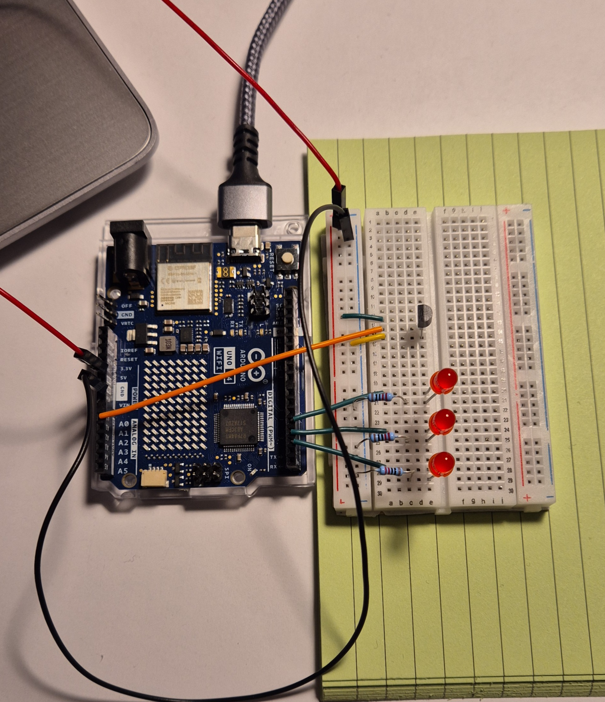

# Project 03 – Temperature Sensor (Chill-o-meter)

## Description
The Chill-o-meter is a simple temperature monitoring system using an Arduino.  
As the temperature increases, more LEDs turn on to visually indicate the change.

## Goal
The goal of this project was to learn how to:
- read analog sensor data
- use conditional logic
- control multiple outputs (LEDs)

## Components
- Arduino Uno
- Temperature sensor (TMP36)
- 3x LEDs
- Resistors
- Breadboard
- Jumper wires

## How It Works
The temperature sensor outputs an analog voltage depending on the temperature.  
The Arduino reads this value and converts it into a temperature reading.

Depending on the temperature:
- low temperature → no LEDs
- medium temperature → 1–2 LEDs
- high temperature → all LEDs ON

This creates a visual “thermometer” using LEDs.

## Demo
Watch the project in action:  
https://youtube.com/shorts/pQ8A2pTnrOk?feature=share

## Code
The code for this project is available in this folder.

## Circuit

## What I Learned
- how to read analog values from a sensor
- how to map sensor data to real-world values (temperature)
- using `if` statements to control outputs
- basic hardware debugging

## Notes
This project helped me better understand how sensors interact with microcontrollers and how to translate real-world data into meaningful output.

## Future Improvements
- display temperature on LCD
- add buzzer for high temperature warning
- improve accuracy with calibration
