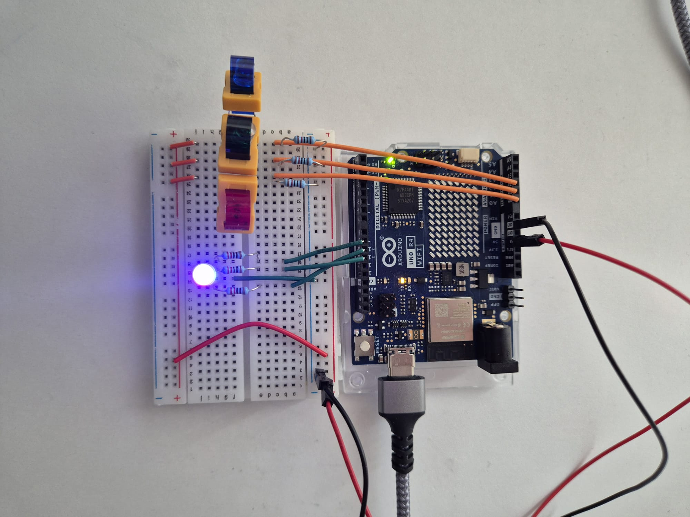
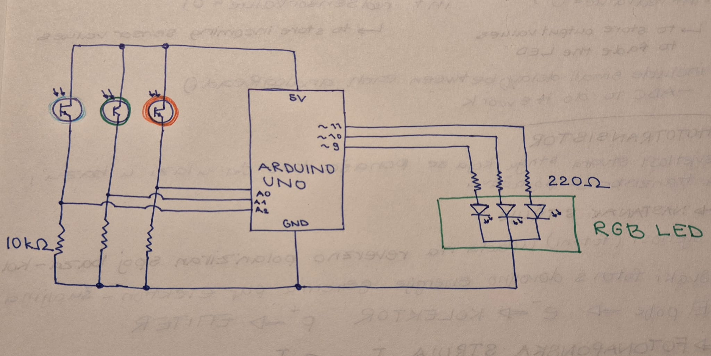

## Description
This project detects the intensity of red, green, and blue light using three phototransistors with color filters.  
The Arduino processes these values and controls an RGB LED to reproduce the detected color in real time.

## Goal
The goal of this project was to understand how light sensors can be used to detect color and how to control an RGB LED using PWM signals.
It demonstrates a practical understanding of:
- Phototransistors and photoelectric effect
- Analog-to-digital conversion (ADC)
- PWM (Pulse Width Modulation) for LED brightness control

## Components
- Arduino Uno
- RGB LED (common cathode)
- 3× Phototransistors
- 3× Current-limiting resistors (for RGB LED, 220Ω)
- 3× Load resistors (for phototransistors, 10kΩ)
- 3x Gels (red, green, blue)
- Jumper wires and breadboard

## How It Works
- Three phototransistors with color filters detect red, green, and blue light components.
- Each phototransistor is connected in common-collector mode.
- The analog pins (A0, A1, A2) read the voltage drop across the emitter resistor.
- The analog values (0–1023) are mapped to a 0–255 range and sent to PWM pins.
- The RGB LED reproduces the detected color by adjusting the brightness of its red, green, and blue channels.

Important note: In this configuration, higher sensor values = brighter light detected. 

## Circuit
- Phototransistor collector → 5V  
- Phototransistor emitter → analog pin (A0, A1, A2) through a 10kΩ resistor to GND  
- RGB LED:
  - Red → pin 10 (PWM)  
  - Green → pin 9 (PWM)  
  - Blue → pin 11 (PWM)  
  - Cathode → GND  

  
  

## Demo
Watch the project in action:
https://youtube.com/shorts/m8uG3f1YL34?si=95o5YV90eodV7VDb

## What I learned
- how phototransistors respond to different light intensities  
- how to use analog inputs to detect real-world signals  
- controlling RGB LEDs using PWM  
- how sensor data can be translated into visual output

## Challenges
The most challenging part was understanding how phototransistors work and how they convert light into electrical signals.  
It also took some time to properly map the sensor values to achieve accurate color reproduction.

## Future Improvements / Experiments
- Automatic calibration (min/max values)
- Smooth color transitions
- Complementary color mode (opposite colors)
- Adding a button or potentiometer for mode switching

## Improvements Implemented
I implemented basic sensor calibration to improve the accuracy of color detection.
Instead of mapping the full 0–1023 range, I measured the real minimum and maximum values for each phototransistor and adjusted the mapping accordingly.
This resulted in more stable and realistic color reproduction under different lighting conditions.

## Before vs After
Before the improvements, the LED changed colors abruptly and was sensitive to lighting conditions.
After implementing calibration, the color transitions became more stable and visually appealing, several different shades came to the fore.

## Technologies Used
- Arduino C++
- Analog sensors (phototransistors)
- PWM control
- Serial communication

## Code
The code for this project is available in this folder.

