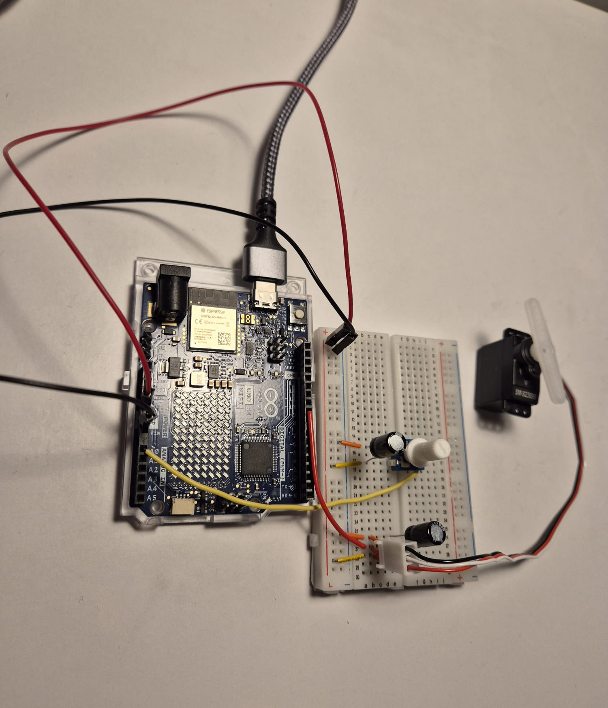

# Project 05 - Analog Servo Controller (Mood Cue)

## Description

This project demonstrates how to read an analog input from a potentiometer and use it to control a servo motor in real time.

The servo acts as a physical pointer that moves between 0° and 180°, creating an interactive "mood cue" or gauge. By turning the potentiometer, the user directly controls the position of the servo, making the system feel immediate and intuitive to use.

## Goal

The goal of this project was to better understand how analog input can be translated into physical movement.

Instead of just reading sensor values, I wanted to create a simple system where a user can directly control a mechanical output in real time. 

## Components

- Arduino Uno R4
- 10 kΩ potentiometer
- Micro servo motor (SM S2309S)
- Jumper wires and breadboard
- 2x 100 nF decoupling capacitors

## How It Works

- A 10 kΩ potentiometer acts as a voltage divider.
- The Arduino reads the analog value from the potentiometer (0–4095 on 12-bit resolution).
- This value is mapped to a servo angle between 0° and 180°.
- The servo motor physically moves an arrow to the corresponding position.
- `delay(15)` ensures smooth and stable movement of the servo.

## Circuit

**Potentiometer:**
- Left pin → **5V**
- Right pin → **GND**
- Middle pin → **A0**

**Servo Motor:**
- Red wire → **5V**
- Black wire → **GND**
- White wire (signal) → **Pin 9**

  

**Important:**  
- A 100 nF capacitor is placed across the servo power pins to stabilize the power supply.  
- An additional 100 nF capacitor is used near the potentiometer to reduce noise on the analog signal.

## Demo
Watch the project in action:
link

## What I Learned

- How a potentiometer works as a voltage divider and how the wiper changes the resistance ratio
- Difference between 10-bit and 12-bit ADC on Arduino Uno R4
- Proper use of the `Servo` library and the `.attach()` method
- Why servo motors need specific pulse widths (1000–2000 μs)
- Importance of decoupling capacitors with motors
- Basics of object-oriented programming in Arduino (creating and using objects)

## Challenges

One of the main challenges was fully understanding how the potentiometer works as a voltage divider.  
While I initially used it just as an input device, I took some time to better understand how the wiper position changes the voltage that the Arduino reads.

Another area I explored more deeply was the role of decoupling capacitors.  
At first, I didn’t fully understand why they were needed, but through testing I learned that they help stabilize the power supply and reduce noise caused by the servo motor.

## Improvements Implemented

The original implementation mapped the full 0°–180° range.
I limited the servo movement range to 0°–90° instead of the full 0°–180°.

This made the system more controlled and easier to use, especially for applications where only a partial range of motion is needed. This also helped reduce jitter and made the movement more stable.

## Future Improvements

- Add multiple "mood zones" with LEDs (e.g. green = happy, red = angry)
- Add a button to save favorite positions

## Technologies Used

- Arduino C++ (with OOP – `Servo` class)
- Analog input (`analogRead()`)
- `map()` function for value scaling
- Servo motor PWM control
- `analogReadResolution()` for Uno R4

## Code

The code for this project is available in this folder.

